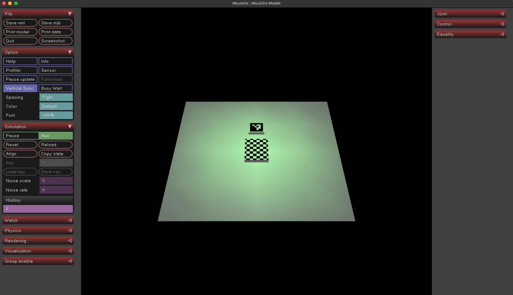

# Lab 1: Colab + MuJoCo

This lab has two parts:
1. Colab notebook introducing basics of OpenCV
2. Local MuJoCo simulator: launching the viewer and exploring a simple world.

## Preparation

All lab materials are on GitHub. To clone the repository:
```bash
git clone <REPO-URL>
cd <REPO-DIR>
```

Throughout the course, we use [`uv`](https://docs.astral.sh/uv/) as the package manager.
You don't have to know much about it to start working on the first lab.
Basically, each lab is a project that requires some dependencies (Python packages it needs to run).
This information lives in two files:
- `pyproject.toml`: what the project says it needs.
- `uv.lock`: the exact, pinned versions to ensure everyone gets the same environment.  

`uv` reads these files and resolves/installs what is required.

## Colab

Notebook: [Lab 1 Colab](https://colab.research.google.com/github/mim-ml-teaching/public-rc-2025-26/blob/refs/heads/main/docs/lab1-public/lab1-colab-student.ipynb)


## MuJoCo

A significant portion of robotics work involves using simulators like MuJoCo.
This part introduces basic viewer usage. We will:

 - (a) open the MuJoCo viewer,
 - (b) load a simple world,
 - (c) detect an existing ArUco marker,
 - (d) generate a new marker,
 - (e) make small XML edits.

### MuJoCo viewer
Starting MuJoCo viewer is simple with `uv`:
```bash
uv run python -m mujoco.viewer
```
A window should appear: 

### Loading the simulation world
With the viewer open, you can drag and drop `world1.xml` into the simulator window (you can also use `uv run python -m mujoco.viewer --mjcf path/to/xml`).
The file describes the simulation environment.
Make sure `4x4_1000-0.png` is in the same directory as `world1.xml`.
You should now see the world loaded in the simulator:

Explore the MuJoCo interface.
Learn how to move the camera, zoom in and out, and rotate the view.

### Detecting Aruco markers
Now take a screenshot of the simulator window.
Use OpenCV to detect the Aruco code in the screenshot.

*Hint:* you should use `cv2.aruco.DICT_4X4_1000` dictionary

### Generating new markers
Follow the instructions described in [this OpenCV tutorial](https://docs.opencv.org/4.x/d5/dae/tutorial_aruco_detection.html) to generate a new Aruco marker and add it to the scene.

Now use OpenCV to detect both Aruco markers in the scene and draw bounding boxes around them.

### Modifying the world:
Change some of the box shapes in the world, e.g., use cylinders or spheres. Explore [the MuJoCo documentation](https://mujoco.readthedocs.io/en/stable/XMLreference.html) for available geom types.

## Notes

You may have noticed some objects appearing to float. In this lab the world is effectively static: the objects you see are geoms attached directly to the world (no joints, no dynamic bodies with mass/inertia), so they are not simulated by physics (no falling under gravity). In later labs we will add dynamic bodies, joints, and forces to make the simulations more realistic.

## References

 - MuJoCo XML Reference: <https://mujoco.readthedocs.io/en/stable/XMLreference.html>
 - OpenCV docs: https://docs.opencv.org
