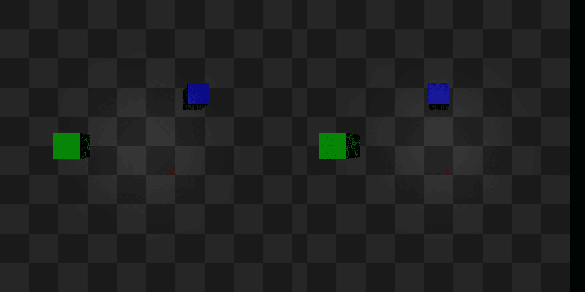

Today's lab consists of two parts. First: Colab, and second: the MuJoCo simulator.

# Colab

Access the Colab notebook: [lab3-colab](https://colab.research.google.com/github/mim-ml-teaching/public-rc-2025-26/blob/refs/heads/main/docs/lab3-public/lab3-colab-student.ipynb). Additional resources are:

- [0.png](0.png)
- [1.png](1.png)
- [2.png](2.png)
- [3_left.png](3_left.png)
- [3_right.png](3_right.png)


download them from [here](https://github.com/mim-uw/rc-2025-26/tree/master/docs/lab3-public) and upload them to your
Colab.


# MuJoCo

For this part, you'll be working with the following MuJoCo XML world:


```xml
<mujoco model="simple_scene">
    <option timestep="0.005" gravity="0 0 -9.81"/>

    <asset>
        <texture name="plane_texture" type="2d" builtin="checker" rgb1="0.2 0.2 0.2" rgb2="0.3 0.3 0.3" width="512" height="512"/>
        <material name="plane_material" texture="plane_texture" texrepeat="5 5" reflectance="0"/>
    </asset>

    <worldbody>
        <geom type="plane" size="1 1 0.1" material="plane_material"/>

        <body pos="0 0 0.5">
            <geom type="box" size="0.1 0.1 0.1" rgba="0.8 0 0 1"/>
        </body>

        <body pos="0.2 0 0.5">
            <geom type="sphere" size="0.1" rgba="0 0.8 0 1"/>
        </body>

        <body pos="-0.2 0 0.5">
            <geom type="cylinder" size="0.1 0.15" rgba="0 0 0.8 1"/>
        </body>

        <!-- Cameras -->
        <camera name="camera1" pos="0 -0.1 1" fovy="90"/>
        <camera name="camera2" pos="0 0.1 1" fovy="90"/>
    </worldbody>
</mujoco>
```

This XML code defines a simple scene with a plane, a box, a sphere, a cylinder, and two cameras. Familiarize yourself with the XML structure and understand the role of each element.

## Visualizing the Scene:
Uv environment is already provided in `pyproject.toml` file.

Open the MuJoCo simulator to view the scene. Pay attention to the XML structure and how each element contributes to the visual scene. Also, note that two cameras ("camera1" and "camera2") are specified in the XML.


The image above demonstrates how you can select the desired camera view within the simulator.

## Tasks

### 1. Changing camera parameters
We want to get a better understanding of how cameras work in MuJoCo.
The best way to achieve this is to play around with various parameters defining the camera.
Refer to the [MuJoCo documentation on cameras](https://mujoco.readthedocs.io/en/stable/XMLreference.html#body-camera) for guidance and modify the XML to:

 - rotate the camera.
 - change the `fovy` parameter to see how it affects the image.
 - remove `fovy` parameter and define the camera using the parameter `focal` instead.

In the last subtask you had to define additional parameters such as `sensorsize`. Try changing this parameter to see how it impacts the resulting view.

### 2. Adding new objects
Add a very small red ball (so small that it's almost not visible) to the scene and change the color of the red box to something else.
In the next task we will need this to distinguish between the red ball and everything else in the world.

### 3. Object detection
Write a program that finds the pixel position of the center of the red ball you have created in the previous task.
You can use the following code to generate pictures from a MuJoCo camera:

```python
import mujoco
from PIL import Image

xml_path = "a.xml"
model = mujoco.MjModel.from_xml_string(open(xml_path).read())
renderer = mujoco.Renderer(model, 1024, 1024)
data = mujoco.MjData(model)
mujoco.mj_forward(model, data)
renderer.update_scene(data, camera="camera1")
img = Image.fromarray(renderer.render())
img.save("red_ball.png")
```
Remember that OpenCV uses BGR by default, not RGB.

### 4. Stereo Matching
Your task is to implement your own depth detection using stereo matching.
Assuming you've downloaded the repo from GitHub, in `mujoco/` directory you can find 3 files: `stereo_vision.py`, `left.png` and `right.png`.
The script `stereo_vision.py` was used to generate the views from two cameras (`left.png`, `right.png`) of a world with two boxes and one sphere.
Sadly, the information about the positions of the objects was lost.


Using all the information still available in the `stereo_vision.py`
and your knowledge about stereo vision,
find the coordinates of the objects.
Finish the implementation of `stereo_vision.py` to reconstruct the views seen in `left.png` and `right.png`.
The objects should be in a similar position,
but don't worry if they are not exactly the same.

Tips:
 - Start by finding the centers of the visible parts of the objects.
 - Remember that the center of the entire box and its top face are slightly different in the `z` coordinate.
 - If you need a refresher about stereo vision, you can find it below.
 - You can use basic trigonometry to find a relation between a focal length `f` and the field-of-view parameter `fovy`: `f * tan(fovy / 2) = image_height / 2`.



## Stereo Vision Refresher

Stereo vision happens when you have access to more than one camera, e.g.:


Stereoscopic imaging allows calculating 3D coordinates without knowing anything about geometry of the object, or scene.
We can even do this with a single point (which will be demonstrated soon).
Stereo camera is an example of a depth camera,
because it can provide information about the depth of the scene.

### Depth calculation


[Image source](https://docs.opencv.org/4.1.2/dd/d53/tutorial_py_depthmap.html)

Quick explanation:
 - We want to estimate the distance from the blue point to the cameras (pinholes) - we are looking for z
 - there are two cameras with pinhole 1 and pinhole 2 respectively
 - image planes are right behind the pinholes at distance f (focal length) and the blue point is projected onto them in different locations
 - baseline is the distance between cameras
 - if x and x' mark positions of the observed blue point in the image planes, then we define the disparity as (x - x')
 - we can calculate the distance using disparity, baseline and f

From similar triangles:
$$
\texttt{disparity}=x-x^{\prime}=\frac{Bf}{Z}
$$

### Dense stereo matching

Last thing that should be mentioned when talking about stereo should be dense stereo matching,
i.e. it is possible to find the disparity not only for some known features like a corner of a marker,
but for every point in the image.
This is done by trying to match pixels or blocks of pixels from the left image in the right image at the same height, but shifted left.

There are some caveats here.
Matching algorithms are not always perfect and almost always require a lot of tuning and are very sensitive to parameters.
As you can see below, there is some noise in the detected depth map.
More on that [here](https://docs.opencv.org/4.8.0/dd/d53/tutorial_py_depthmap.html)


