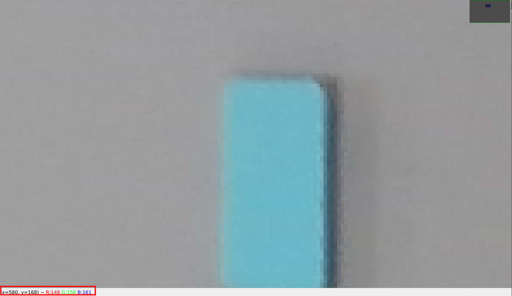
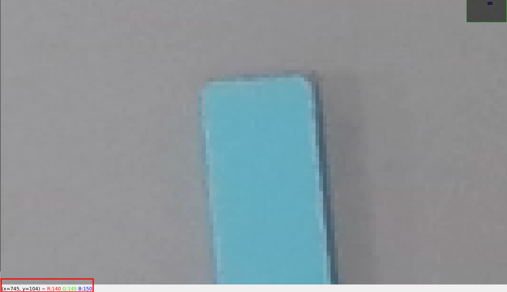

# Homework 1: Image Stitching

## Final Report

The primary result of this project should be a detailed report in your `README.md` file. This report should document your entire process, including the code you wrote, the experiments you conducted, and the results you obtained. If you want instead of `README.md` to create a separate `report.pdf` file, that is also acceptable.

Think of this report as your lab notebook. We want to see how you approached the problems, what worked, what didn't, and what you learned. Include visualizations, quantitative results (like reprojection error), and your observations for each task.

**Important:** We do not expect a perfectly polished essay. Focus on clear, technical communication. We are more interested in your authentic work and thought process than in beautiful prose. To that end, we strongly encourage you to write the report yourselves and **avoid using Large Language Models (LLMs)** for its creation. Your own words, even if imperfect, are what we value.

All programs must be runnable from the root of your submission archive using a `uv` command, such as `uv run python solution.py`.

## Updates

## Submission format

**The submission deadline is Nov 23 (Sunday), 23:59 2025.**

You should submit via moodle. You should submit a zip or tgz file containing:

* `README.md` and all the files that are necessary to view it (e.g. images)
* created panoramas
* source code

The solution file should be named `<students login>.tgz` (or `<students login>.zip`).

## Task description

In this assignment, you should make a panorama of two photos. The method you will be using is called image stitching and it was described during the Lecture (you can access slides and recording on github pages).

You can download the dataset from [https://www.mimuw.edu.pl/~ciebie/rc25-26](https://www.mimuw.edu.pl/~ciebie/rc25-26). Dataset consists of two parts:

* calibration images
* photos for stitching

There are two different types of calibration boards used in the calibration images:

* 9 x 13 asymmetric circle calibration board, 40mm diameter circles, 70mm spacing
* 16 x 22 calibration board with ArUcO tags dictionary aruco.DICT_4X4, checker size 30mm

There are three pairs of photos that should be used for stiching.

### Task 1 - Camera Calibration and Image Undistortion (3 points)

The first step is to calibrate your camera to correct for lens distortion. Lens distortion can cause straight lines in the real world to appear curved in an image, which will prevent accurate image stitching. By calibrating the camera, you will find the camera's intrinsic parameters and distortion coefficients. These parameters will then be used to undistort the photos you will stitch in the later tasks.

**Your tasks are to:**

1. **Calibrate the camera:** Using the provided calibration images, determine the camera matrix and distortion coefficients. The dataset includes two types of calibration patterns:
    * A 9x13 asymmetric circle grid.
    * A 16x22 board with ArUco tags.
    You may choose which pattern to use and you don't have to use all the provided images for the pattern you choose.

2. **Visualize the detected patterns:** To verify that your calibration is working correctly, you should create and save visualizations. For each calibration image you use, generate a version with the detected pattern (e.g., corners of the chessboard, contours of the circles, or ArUco markers) drawn on it. This will provide visual confirmation that your detection algorithm is functioning as expected.

3. **Undistort the stitching photos:** Apply the calculated calibration parameters to remove distortion from the images you will use for stitching. For verification, create a side-by-side comparison of an original and an undistorted image to visually inspect the result.

4. **Document your process:** In your `README.md` file, you must:
    * Carefully describe the calibration process you followed.
    * Explain any problems you encountered and how you solved them (e.g., issues with pattern detection, selection of images).
    * Include the tools and code you used for calibration in your final submission.
    * How do you measure the quality of your calibration? Provide quantitative metrics. A common metric is the **reprojection error**, which measures the distance between the projected 3D points and the detected 2D points. Report this error in your `README.md`.

### Task 2 - Projective Transformation (3 points)

As you remember from the lecture, one of the most important steps in image stitching is projecting all images on a common plane - this allows us to merge them into one picture.

That's why your first task is to write a function that takes an image and a projective transformation matrix, applies the projective transformation to the image, and displays both the original image and the transformed image.

You can implement the function by taking each pixel from the *destination* image and map it to a single pixel in the *source* image (by using the inverse homography).
It is enough to use a nearest neighbor to find a pixel in the *source* image, it is not required to interpolate between the neighboring pixels.
You can implement it by using loops, no need to vectorize your solution.

### Task 3 - Finding Projective Transformation (2 points)

Using `linalg.svd` write a function that finds a projective transformation based on a sequence of matching point coordinates.
As described during the lecture this can be done by casting the problem as an instance of the
constrained least squares problem, i.e., given `A` find `x` such that the squared norm of `Ax` is minimized
while having `x` a unit vector.
Check slides (and lecture notes) from Lecture 2  for a solution to this problem by finding the
Eigenvector corresponding to the smallest eigenvalue of the matrix `transpose(A) * A`.
In practice it is actually good to exploit the structure of `transpose(A) * A` to find its eigenvectors. Therefore, instead of using the general `linalg.eig` on the `transpose(A) * A` matrix, one can use `linalg.svd` on the `A` matrix and determine the smallest eigenvector of `transpose(A) * A` from singular value decomposition of `A`. Here's a code snippet which performs this operation (you can use it in your solution):

```python
_, _, V = np.linalg.svd(A)
eingenvector = V[-1, :]
```

Note: it is required to write tests to your method.
The test should pick a random homography, compute the matching pairs based
on this homography and check that the implemented method recovers it (up to a scale factor). A good way to check this is to normalize both matrices (e.g., by dividing by the bottom-right element) and then use a function like `numpy.testing.assert_allclose` to compare them. This should be repeated several times with different random homographies.

### Task 4 - Finding Projective Transformation by Hand (1 point)

Find 2D coordinates of a few points that are visible on both photos by hand.
Coordinates should be quite accurate — up to a single pixel.
You can do this for example by displaying an image in `cv2.imshow()` or `plt.imshow()`
and zooming in so that single pixels are big enough to distinguish their coordinates. For a more user-friendly approach, consider creating a simple interactive tool using `matplotlib`'s `ginput` function, which allows you to click on the image to get pixel coordinates. Below are examples of the coordinates displayed of the top left corner of the blue block between the source and destination images.

Top left corner of blue block in src image:


Top left corner of blue block in dest image:


Using those coordinates as a ground truth find a projective transformation between the right and the left photo using results of the previous task.

### Task 5 - Image Stitching (3 points)

Using the projective transformation you have already found, stitch all pairs of the photos into one. Before blending, it is a good practice to visualize the warped images on a common canvas to ensure they are aligned correctly. Then, use any of the methods described during the lecture (e.g. naive overlay, linear blending, feathering, multi-band blending) or found on-line.

Document your method in `README.md` and save the resulting panoramas as `task_5_stitched_pair_1.jpg`.

### Task 6 - Robust Image Stitching with ORB and RANSAC (4 point)

Learn about ORB: [OpenCV docs](https://docs.opencv.org/4.x/d1/d89/tutorial_py_orb.html) and use it to automatically find matching points between the photos.

Not all matches found by ORB will be correct. To handle these outliers, it is standard practice to use a robust estimation algorithm like RANSAC.

**Your tasks are to:**

1. Find keypoints and descriptors using ORB.
2. Match the descriptors between the two images.
3. Use `cv2.findHomography` with the RANSAC method to compute a robust projective transformation from the matches. This function will handle the outliers for you.
4. To inspect the quality of the robust matching, create a visualization that draws only the inlier matches (the ones that are consistent with the found homography). `cv2.findHomography` returns a mask that tells you which matches are inliers.
5. Stitch the photos together using the robustly estimated transformation.
