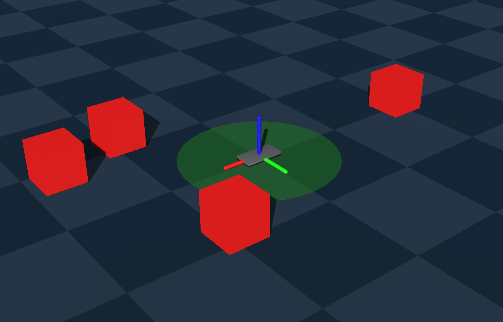
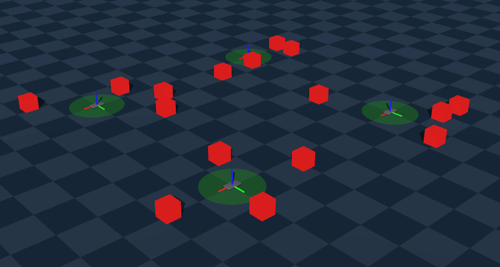

# Genesis lab

Created by Aleksander Wojsz and Jan Kuźma

## Installation

To run the code for this lab, we encourage you to use `uv`.

For CPU usage, simply run your scripts using `uv run script.py`.

For NVIDIA GPU usage, you need to install a version of Pytorch compatible with your CUDA version.

1. Uninstall the default torch (if installed):
```bash
uv pip uninstall torch
```

2. You can check which CUDA version your GPU supports or which driver you have installed:
```bash
nvidia-smi       # shows driver version and supported CUDA version
```
or
```bash
nvcc --version   # if you have CUDA toolkit installed
```

3. Install the CUDA version from [here](https://pytorch.org/get-started/locally/), e.g.:
```bash
uv pip install torch==2.2.0+cu130 torchvision==0.18.0+cu130 torchaudio==2.2.0 --index-url https://download.pytorch.org/whl/cu130
```

It is possible to use AMD GPU, although it is a problematic (especially on Windows), and this topic will not be covered here.

## Goals

The main goals of this lab are to learn:

- how to use [Genesis](https://genesis-embodied-ai.github.io/) for physics simulation
- how to control a robot from Python
- how to work with parallel environments

## Steps

1. Configuring Genesis
2. Adding entities
3. Building the scene. Parallelization
4. Controlling the robot
5. Win a simple game (one env)
6. Win the game (multiple envs)

### Step 1: Configure Genesis

Let's start by initializing Genesis and creating a scene.

> You can run Genesis on CPU or GPU.
> - CPU: uses Numpy or Pytorch. Good for fewer parallel environments.
> - GPU: Uses Pytorch (CUDA). Good for massive parallelization.


```python
import genesis as gs
import torch
import numpy as np

# Select device
device = 'cuda' if torch.cuda.is_available() else 'cpu'

# 1. Initialize Genesis
gs.init(backend=gs.cpu if device == 'cpu' else gs.gpu)

# 2. Create Scene
scene = gs.Scene(
    sim_options=gs.options.SimOptions(
        dt=0.01
    ),
    viewer_options=gs.options.ViewerOptions(
        camera_pos=(2, -2, 2),
        camera_lookat=(0.0, 0.0, 0.0),
        max_FPS=60,
    ),
    show_viewer=True,
)
```

**Viewer**: In the example above, we set `show_viewer=True` to see what's happening in the simulation. However, rendering graphics is slow, so if you don't need it, you can turn it off to maximize performance.

### Step 2: Adding entities

In Genesis, we add objects using `scene.add_entity`. You can add primitives using [Morphs](https://genesis-world.readthedocs.io/en/latest/api_reference/options/morph/index.html) or import complex robots using *MJCF* (MuJoCo XML files).

```python
# Adding floor morph (Plane)
scene.add_entity(
    gs.morphs.Plane(pos=(0, 0, 0))
)

# Adding box morph
box = scene.add_entity(
    gs.morphs.Box(
        pos=(0, 0, 0.5),
        size=(0.2, 0.2, 0.2)
    ),
    surface=gs.surfaces.Default(color=(1, 0, 0, 1)),
    material=gs.materials.Rigid(
        rho=100.0, # Density
        friction=1.0
    )
)

# Adding entity from MJCF file
gripper = scene.add_entity(
    gs.morphs.MJCF(file='gripper.xml')
)
```

### Step 3: Building the scene. Parallelization

`scene.build()` method determines if we are running just one or many simulations simultaneously.

>Why Pytorch for GPU?
When using `gs.init(gs.gpu)`, Genesis keeps the simulation state on the GPU's VRAM. If you use Numpy, the data has to be copied from GPU to CPU, which is slow. Pytorch tensors can stay on the GPU and don't have to be copied.

#### Option A: single environment

If you don't need parallelization:

```python
scene.build(n_envs=0)
```

- Tensor shape: tensors represent the state of that single environment.
- Example position: `[x, y, z]` -> shape `(3,)`.

#### Option B: parallel environments

If you want to run multiple independent simulations at once:

```python
scene.build(
    n_envs=4, 
    env_spacing=(3.0, 3.0) # For visualization only. Doesn't change simulation results
)
```

- Tensor shape: every function gets an additional batch dimension.
- Example position: `[[x1, y1, z1], [x2, y2, z2], ...]` -> shape `(n_envs, 3)`.


> Genesis is highly optimized for parallel environments and can achieve millions of FPS in total.

### Step 4: Controlling the robot

#### A) Setting gains (PD control)

Before controlling the robot, we usually set the proportional (kp) and derivative (kv) gains. 
These gains determine how big the actual control force will be, given a target joint position or velocity. Often, these information will be parsed from the imported MJCF.

```python
# Assuming an entity has 3 joints (x, y, z). For our case, lets set up the gripper gains.
gripper.set_dofs_kp(np.array([500, 500, 500])) 
gripper.set_dofs_kv(np.array([50, 50, 50]))
```

#### B) Reading state

Reading the position of joints returns a tensor.

```python
pos = gripper.get_dofs_position()
print(pos.shape) 
```

- Single env (`n_envs=0`): Returns `(3,)`
- Parallel env (`n_envs=4`): Returns `(4, 3)` (one row per environment)

#### C) Moving objects

1. `set_dofs_position`: Teleports the object. Used for resetting the environment. Ignores physics.
2. `control_dofs_position`: Applies forces to reach the target. This is how a robot moves physically, without teleportation.
3. `scene.step()`: Advances the simulation by one time step (defined by `dt` in `SimOptions`). This is where the physics engine calculates collisions, forces, new positions etc.

**Example**: moving the robot

*Single env:*

```python
target = torch.tensor([0.5, 0.5, 0.2], device=device)

gripper.control_dofs_position(target)
for _ in range(500):
    scene.step()
```

*Parallel env (4 envs):*

```python
# We need to provide a target for all environments.
target = torch.tensor([
    [0.5, 0.5, 0.2], # Target for env 0
    [0.5, 0.5, 0.2], # Target for env 1
    [0.0, 0.0, 0.0], # Target for env 2
    [0.5, 0.5, 0.2]  # Target for env 3
], device=device)

gripper.control_dofs_position(target)
for _ in range(500):
    scene.step()
```

*Targeting specific environments*: you can apply actions (for example `set_position`/`set_dofs_position`) to specific environments using the `envs_idx` argument.

*Example*:

```Python
box.set_dofs_position(
    position=torch.tensor([
        [1.0, 1.0, 0.5], 
        [1.0, 1.0, 0.5]
    ], device=device),
    envs_idx=torch.tensor([0, 1], device=device) # Target just the envs 0 and 1
)
```

### Step 5: Win a simple game (one env)

We have prepared a script that sets up a scene with a simple gripper and 4 boxes placed randomly. 

The environment should look like this:



Your task is to control the gripper to push all boxes into the green target zone (center).

**Hint: Moving the Box**

To push a box toward the center, first compute a **starting point along the vector from the center through the box**. You can use this formula:

```
                                box_pos
starting_point = box_pos + ---------------- * d
                             norm(box_pos)
```

where d determines how far from the box the gripper starts pushing (e.g. d = 0.4).

Below is the code to be completed.

```python
import numpy as np
import genesis as gs
import torch
from typing import List, Tuple, Any


BOXES_NUMBER = 4
BOX_SIZE = 0.2
DISTANCE_FROM_CENTER_TO_PASS = 0.4


def create_environment(device: str) -> Tuple[gs.Scene, Any, List[Any]]:
    # Initialize genesis
    gs.init(backend=gs.cpu if device == 'cpu' else gs.gpu)

    # Create scene
    scene = gs.Scene(
        sim_options=gs.options.SimOptions(
            dt=0.01,
        ),
        viewer_options=gs.options.ViewerOptions(
            camera_pos=(2, -2, 2),
            camera_lookat=(0.0, 0.0, 0.0),
            camera_fov=30,
            max_FPS=60,
        ),
        show_viewer=True,
    )

    # Add floor
    scene.add_entity(
        gs.morphs.Plane(
            pos=(0, 0, 0)
        )
    )

    # Add target visualization
    scene.add_entity(
        gs.morphs.Cylinder(
            radius=DISTANCE_FROM_CENTER_TO_PASS,
            height=0.002,
            pos=(0, 0, 0),
            collision=False,
            fixed=True
        ),
        surface=gs.surfaces.Default(color=(0, 0.5, 0, 0.5)),
    )

    # Add gripper
    gripper = scene.add_entity(
        gs.morphs.MJCF(file='gripper.xml')
    )

    # Add boxes. Position does not matter for now.
    boxes = []
    for i in range(BOXES_NUMBER):
        box = scene.add_entity(
            gs.morphs.Box(
                pos=(0, (i + 1) * BOX_SIZE, BOX_SIZE / 2),
                size=(BOX_SIZE, BOX_SIZE, BOX_SIZE)
            ),
            material=gs.materials.Rigid(
                rho=100.0, 
                friction=1.0
            ),
            surface=gs.surfaces.Default(
                color=(1, 0, 0, 1)
            ),
        )
        boxes.append(box)

    scene.build()

    # Now, move boxes to random positions.
    positions = []
    while len(positions) < BOXES_NUMBER:
        candidate = np.random.uniform(-1, 1, size=2)

        if np.linalg.norm(candidate) <= DISTANCE_FROM_CENTER_TO_PASS:
            continue
            
        if positions:
            distances = np.abs(np.array(positions) - candidate)
            if np.any(np.all(distances <= BOX_SIZE, axis=1)):
                continue
        
        positions.append(candidate)
    
    for box, position in zip(boxes, positions):
        box.set_dofs_position(
            dofs_idx_local=[0,1,2], # Change only x,y,z
            position=[position[0], position[1], BOX_SIZE / 2],
        )

    # Set gripper gains
    gripper.set_dofs_kp(np.array([500, 500, 500])) # x, y, z
    gripper.set_dofs_kv(np.array([50, 50, 50]))

    return scene, gripper, boxes


if __name__ == "__main__":

    device = 'cuda' if torch.cuda.is_available() else 'cpu'
    scene, gripper, boxes = create_environment(device=device)

    # TODO
    # Your code here
```

### Step 6: Win the game (multiple envs)

Now, rewrite the solution to work with parallel environments.

> When using n_envs > 0, all entities are copied across environments. This means that initially, all environments are identical. To make environments different, we can to iterate through them and set random positions for the boxes in each environment individually after the simulation is started.

In the `create_environment` use:
```python
scene.build(n_envs=ENVS_NUMBER, env_spacing=(3.0, 3.0))

# Now, for each environment move boxes to random positions.
for env_id in range(ENVS_NUMBER):
    positions = []
    while len(positions) < BOXES_NUMBER:
        candidate = np.random.uniform(-1, 1, size=2)

        if np.linalg.norm(candidate) <= DISTANCE_FROM_CENTER_TO_PASS:
            continue
            
        if positions:
            distances = np.abs(np.array(positions) - candidate)
            if np.any(np.all(distances <= BOX_SIZE, axis=1)):
                continue
        
        positions.append(candidate)
    
    for box, position in zip(boxes, positions):
        box.set_dofs_position(
            dofs_idx_local=[0,1,2], # Change only x,y,z
            position=[[position[0], position[1], BOX_SIZE / 2]],
            envs_idx=[env_id]
        )
```

Remember to define `ENVS_NUMBER`.

For `ENVS_NUMBER=4`, the environment should look like this:


