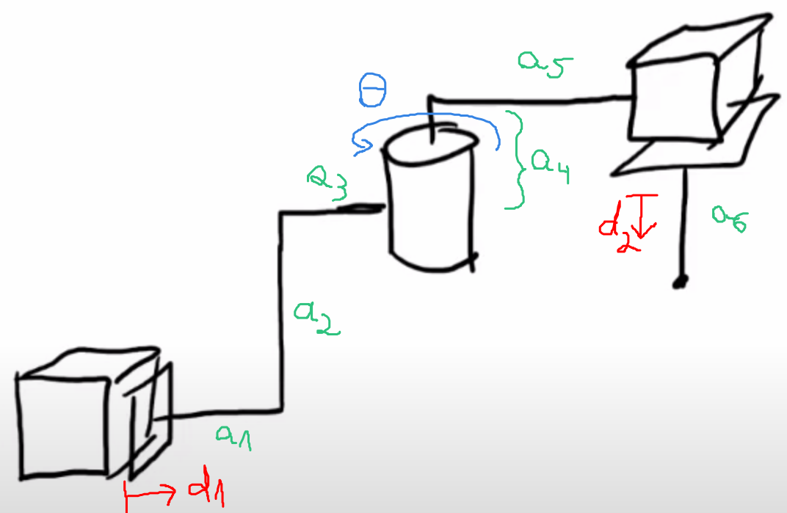

# Robot Control Exam, Task 2 -- DH convention, FK, IK

Given the visual description of the kinematic chain, consisting of:

1.  prismatic joint attached to base with actuation $d_1$ from 0 to 1
    right

2.  link: $a_1$ right, $a_2$ up, $a_3$ right

3.  revolute joint with actuation $\theta$ from 0 to $2\pi$

4.  link: $a_4$ up, $a_5$ right

5.  prismatic joint with actuation $d_2$ from 0 to 1 downwards

6.  link: $a_6$ down, ending with the end-effector

Please do the following:

1.  Find the forward kinematics $FK(d_1, \theta, d_2)$ of the robot

2.  Find the workspace of the robot with fixed $d_1 = 0$

3.  Find the inverse kinematics of the robot with fixed $d_1 = 0$, ie.
    $IK(x, y, z) = (\theta, d_2)$, such that
    $FK(0, \theta, d_2) = (x, y, z)$

4.  Assign frames to the joints of the kinematic chain using the
    DH-convention

5.  Create the DH-table for the kinematic chain including the actuation
    of joints

Each subtask is worth $20\%$ of points for the task.
